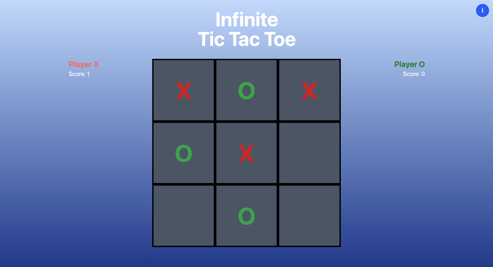

# 🎮 Infinite Tic Tac Toe

A modern twist on the classic Tic Tac Toe game — built with **React** and styled using **Tailwind CSS**. This version adds an infinite gameplay loop: after placing 3 marks, the first one disappears, keeping the game dynamic and strategic. First to win 3 rounds takes the crown. 🏆

---

## 🖼️ UI Preview

### 🟦 Game Interface
A responsive, polished UI with a clean 3x3 grid:


---

## ✨ Gameplay Highlights

### 🎯 Place Your Move
Click on a tile to place your mark — X (red) or O (green):


---

### 🧠 Win Rounds by Getting 3-in-a-Row
Once a player gets 3 adjacent marks, they win the round and their score increases:


---

### 🏁 First to 3 Rounds Wins the Game
The game resets when someone reaches 3 rounds — best of 5 format:


---

### ℹ️ Interactive Info Box
Hover over the info icon in the top-right corner to learn how to play:


---

## 🛠️ Tech Stack

- ⚛️ **React** – Component-based UI
- 💨 **Tailwind CSS** – Utility-first styling
- 🧠 **Custom Game Logic** – Built from scratch with state management
- ♻️ **Responsive & Animated** – Works across screen sizes with smooth transitions

---

## 🚀 Getting Started

1. **Clone the repo:**
   ```bash
   git clone https://github.com/your-username/infinite-tic-tac-toe.git
   cd infinite-tic-tac-toe
